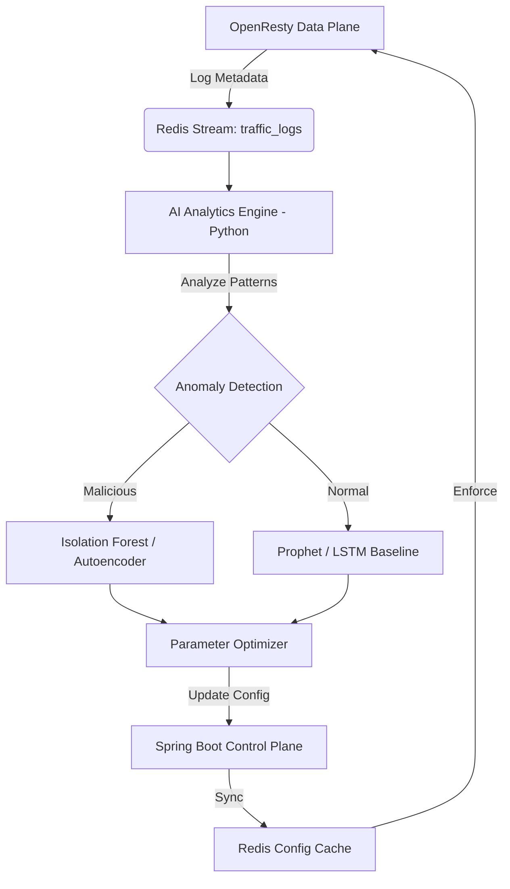

# AI Traffic Detection & Automated Protection Plan

This feature introduces an AI-driven layer to the DPaaS platform to automatically detect malicious traffic patterns and dynamically adjust rate-limiting parameters.

## Proposed Architecture

## Proposed Changes

### 1. Data Ingestion (Data Plane)
Modify the OpenResty configuration to asynchronously push request metadata to Redis.

#### [MODIFY] [nginx.conf](file:///home/yeager404/Workspace/Lua/DDosPaas/nginx.conf)
- Update `log_by_lua_block` to use `XADD` to a Redis Stream named `traffic_logs`.
- Metadata included: `timestamp`, `remote_addr`, `apiKey`, `endpoint_path`, `status`, `request_time`.

### 2. AI Analytics Engine [NEW COMPONENT]
A new Python-based service responsible for processing traffic data.

#### [NEW] [ai_engine/main.py](file:///home/yeager404/Workspace/Lua/DDosPaas/ai_engine/main.py)
- **FastAPI / Celery**: Scaffolding for the service.
- **Consumer**: Listens to the `traffic_logs` Redis Stream.

#### [NEW] [ai_engine/models/anomaly_detector.py](file:///home/yeager404/Workspace/Lua/DDosPaas/ai_engine/models/anomaly_detector.py)
- **Model**: **Isolation Forest** (Unsupervised).
- **Technique**: Feature extraction from sliding windows (e.g., request frequency per IP, entropy of requested paths, variance in inter-arrival times).
- **Goal**: Identify "outlier" behavior typical of botnets or volumetric attacks.

#### [NEW] [ai_engine/optimizer/param_tuner.py](file:///home/yeager404/Workspace/Lua/DDosPaas/ai_engine/optimizer/param_tuner.py)
- **Model**: **Reinforcement Learning (PPO)** or **Bayesian Optimization**.
- **Technique**: The engine learns the "Effective Capacity" by monitoring the ratio of 200 vs 429 status codes and user-reported latency.
- **Action**: Dynamically pushes suggested `capacity` and `refill_rate` to the Control Plane.

### 3. Control Plane Integration (Spring Boot)
Enhance the backend to receive and validate AI-suggested parameters.

#### [MODIFY] [backend/EndpointController.java](file:///home/yeager404/Workspace/Lua/DDosPaas/dpaas/src/main/java/com/yeager/dpaas/endpoint/EndpointController.java)
- Add an internal endpoint `/internal/ai/update-limits` accessible only by the AI engine.

## Model & Technical Details

| Component | model/Technique | Rationale |
| :--- | :--- | :--- |
| **Detection** | **Isolation Forest** | Best for high-dimensional anomaly detection without labeled data. High scalability for real-time ingestion. |
| **Forecasting** | **Prophet (Meta)** | Handles seasonality (daily/weekly traffic spikes) to prevent false-positives during natural peak hours. |
| **Optimization**| **Token Bucket Tuning** | Mathematical model where `refill_rate` = `avg_traffic * alpha` and `capacity` = `burst_tolerance`. AI learns `alpha` and `tolerance`. |
| **Storage** | **Redis Streams** | Extremely low latency (sub-ms) for transferring data from Data Plane to AI Engine. |

## Verification Plan

### Automated Tests
1.  **Ingestion Test**: Simulate traffic through the gateway and verify entries in Redis Stream `traffic_logs`.
2.  **Detection Test**: Replay a "slow-loris" or "volumetric" attack dataset and verify the Isolation Forest flags the IPs.
3.  **End-to-End Sync**: Verify that a change suggested by `param_tuner.py` propagates to the Lua `token_bucket.lua` within < 5 seconds.

### Manual Verification
- Use `locust` or `ab` (Apache Benchmark) to simulate normal vs. aggressive traffic.
- Observe the Dashboard to see real-time rate-limit adjustments by the AI.
